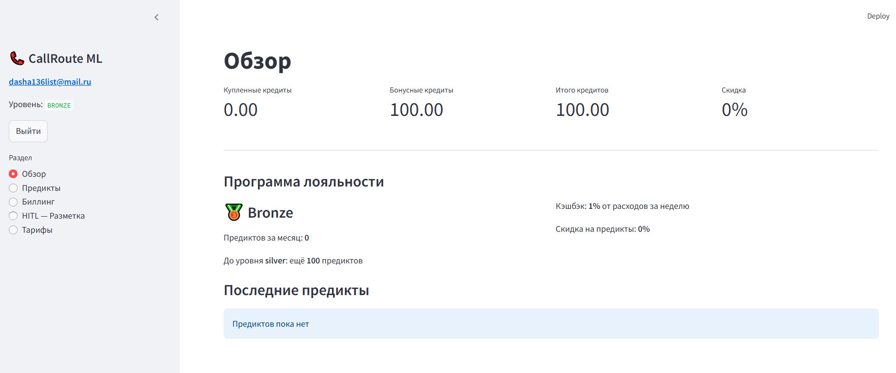
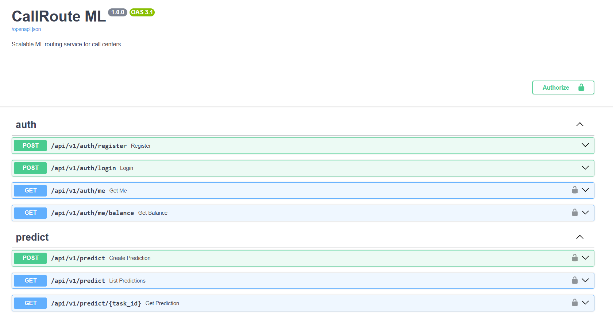

# CallRoute ML

> ML-сервис для классификации обращений в колл-центре/чатах с биллингом, лояльностью и Human-in-the-Loop разметкой
P.S.Ян Олегович, очень хотелось реализовать калькулятор, который считает каждый пример за деньги, но не стала....
---

## Что это такое

CallRoute ML — масштабируемый API-сервис, который принимает текст обращения (звонка, сообщения), классифицирует его по интенту и рекомендует, в какую очередь направить клиента. За каждый предикт списываются кредиты — есть своя биллинговая система с уровнями лояльности, кэшбэком и реферальной программой. В большей степени разные степени лояльности будут использоваться заказчиками, нежели отдельными клиентами.

Проект сделан в рамках учебного курса, но с "poduction like" архитектурой: async FastAPI, Celery-воркеры, PostgreSQL, Redis, Prometheus + Grafana, Docker Compose.

---

## Скриншот страницы после регистрации



---

## Архитектура

```
                          ┌─────────────┐
                          │   nginx :80  │
                          └──────┬───────┘
                    ┌────────────┴────────────┐
                    ▼                         ▼
            ┌──────────────┐         ┌──────────────┐
            │  FastAPI :8000│         │Streamlit :8501│
            └──────┬───────┘         └──────────────┘
                   │
          ┌────────┴────────┐
          ▼                 ▼
   ┌────────────┐    ┌────────────┐
   │ PostgreSQL  │    │   Redis    │
   └────────────┘    └─────┬──────┘
                           │
              ┌────────────┴────────────┐
              ▼                         ▼
      ┌──────────────┐         ┌──────────────┐
      │ worker-fast  │         │ worker-smart │
      │ (CatBoost)   │         │ (rubert-tiny2│
      └──────────────┘         └──────────────┘
```
Я все же посмотрела немного про nginx, и если верно все разобрала, то данная архитектура - это reverse proxy pattern.
**Стек:** Python 3.11 · FastAPI · SQLAlchemy (async) · Celery · PostgreSQL · Redis · Docker Compose · Prometheus · Grafana · Streamlit

---

## ML-модели

Обе модели обучены на датасете [DeepPavlov/massive_ru](https://huggingface.co/datasets/DeepPavlov/massive_ru), адаптированном под 4 call-center класса:

| Класс | Очередь |
|---|---|
| `account_management` | account_team |
| `general_inquiry` | first_line_support |
| `technical_issue` | tech_support |
| `entertainment` | first_line_support |

**Fast (тариф 1 кредит)** — TF-IDF + CatBoost, inference < 15ms, accuracy 86%, F1 macro 0.87

**Smart (тариф 3 кредита)** — fine-tuned `cointegrated/rubert-tiny2`, inference < 500ms, accuracy 93%, F1 macro 0.94

Если уверенность модели < 0.55 — предикт помечается `low_confidence` и уходит в HITL-очередь для ручной разметки пользователями.

---

## Биллинг

Реализованы варианты Б и В из задания:

- **Два счёта:** купленные кредиты и бонусные (списание сначала с бонусного)
- **Уровни лояльности:** Bronze / Silver / Gold — скидки 0/5/10% на предикты
- **Кэшбэк:** раз в неделю возвращается % от расходов на бонусный счёт
- **Реферальная программа:** уникальный код при регистрации, бонус обоим при использовании
- **HITL-геймификация:** за разметку чужих low_confidence предиктов начисляются бонусные кредиты

Атомарность операций обеспечена через `SELECT FOR UPDATE` + version-поле в таблице балансов.

---

## Быстрый старт

```bash
git clone <repo>
cd callroute-ml

cp env.example .env

docker-compose up --build
```

Сервисы после запуска:

| Сервис | URL |
|---|---|
| API + Swagger | http://localhost/docs |
| Дашборд | http://localhost:8501 |
| Grafana | http://localhost:3000 (admin/admin) |
| Prometheus | http://localhost:9090 |

---

## Структура проекта

```
callroute-ml/
├── api/                    # FastAPI приложение
│   ├── routers/            # auth, predict, billing, admin
│   ├── models/             # SQLAlchemy модели
│   ├── services/           # BillingService
│   └── middleware/         # Prometheus метрики
├── worker/                 # Celery воркеры
│   ├── ml/                 # FastModel, SmartModel, ModelRegistry
│   └── tasks/              # predict_task, loyalty_task, cashback_task
├── dashboard/              # Streamlit дашборд
├── ml_training/            # Jupyter ноутбуки обучения моделей
│   ├── 01_data_preparation.ipynb
│   ├── 02-train-fast-model.ipynb
│   └── 03-train-smart-model.ipynb
├── migrations/             # Alembic миграции
├── monitoring/             # Prometheus, Grafana, алерты
├── nginx/
├── tests/                  # pytest тесты (покрытие около 70%)
└── docker-compose.yml
```

---

## API

Полная документация: `http://localhost/docs` (Swagger).

Основные эндпоинты:

```
POST /api/v1/auth/register     — регистрация
POST /api/v1/auth/login        — логин, получение JWT

POST /api/v1/predict           — создать задачу классификации (async, 202)
GET  /api/v1/predict/{task_id} — статус и результат задачи
GET  /api/v1/predict           — история предиктов

GET  /api/v1/billing/balance      — текущий баланс
POST /api/v1/billing/topup        — пополнить баланс
GET  /api/v1/billing/transactions — история транзакций
GET  /api/v1/billing/loyalty      — уровень лояльности и прогресс
GET  /api/v1/billing/hitl/tasks   — доступные задания для разметки
POST /api/v1/billing/hitl/tasks/{id}/complete — сдать разметку

GET  /api/v1/admin/stats       — статистика (только admin)
GET  /api/v1/admin/users       — список пользователей
```

---

## Тесты

Покрыты: auth, billing, predict, admin — около 70%.
Ветка - coverage

---

## Мониторинг

Тут честно признаюсь, у меня к сожалению не вышло настроить grafana и prometheus. Но они включены в архитектуру.
Перспективы развития моего сервиса скажем так.

---

## Переменные окружения

Все настройки через `.env` (`env.example`).

| Переменная | Описание |
|---|---|
| `SECRET_KEY` | JWT-секрет |
| `DATABASE_URL` | PostgreSQL connection string |
| `REDIS_URL` | Redis |
| `LOW_CONFIDENCE_THRESHOLD` | Порог OOD (default 0.55) |
| `DEFAULT_SIGNUP_BONUS` | Приветственный бонус в кредитах |
| `FAST_MODEL_PATH` / `FAST_TFIDF_PATH` | Пути к артефактам CatBoost |
| `SMART_MODEL_PATH` | Путь к fine-tuned rubert-tiny2 |

---

## Чек-лист приёмки

- [x] JWT-аутентификация с ролями (user / admin)
- [x] Биллинг с атомарными транзакциями
- [x] Асинхронный ML через Celery + Redis
- [x] Swagger-документация на всех эндпоинтах
- [x] `docker-compose up` — единственная команда для запуска
- [] Мониторинг в Grafana
- [x] Покрытие тестами > 70%
- [x] Бизнес-план: УТП, финмодель, тарифная сетка (в архитектурном документе)
